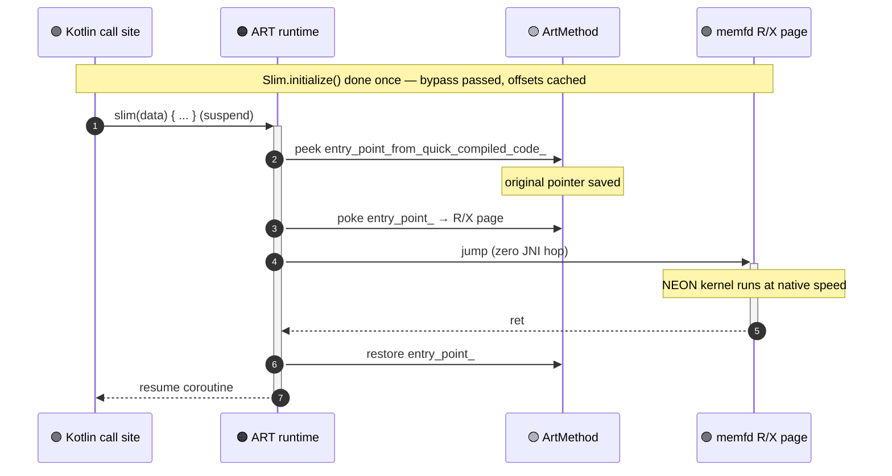
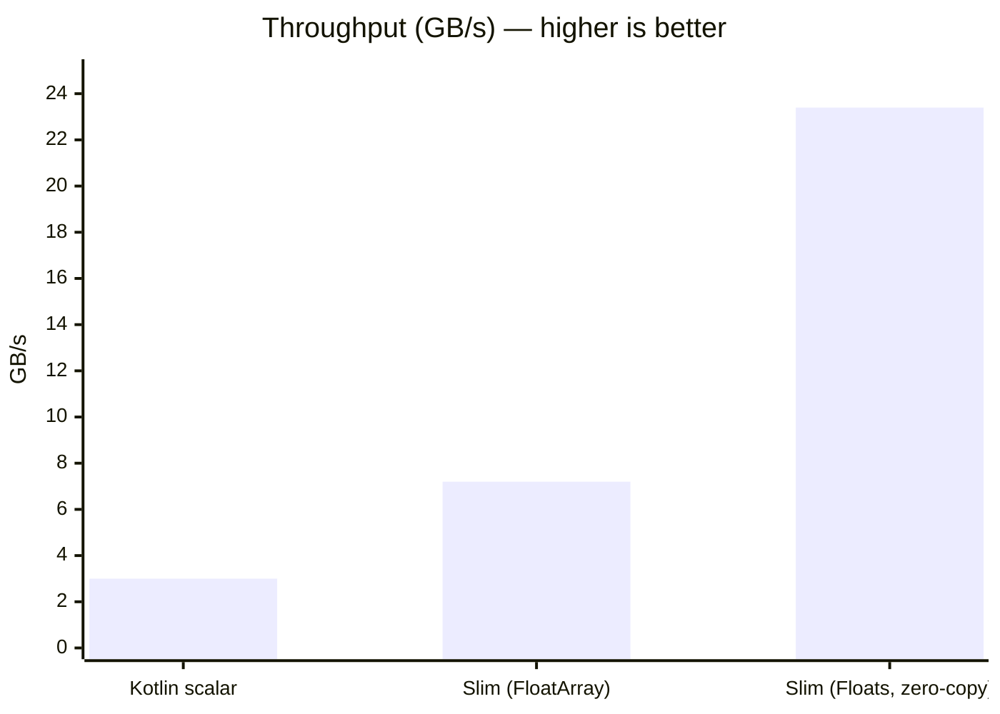

<div align="center">

<a href="https://github.com/iamjosephmj/Slim">
  
</a>

<br/>

<a href="https://readme-typing-svg.demolab.com">
  
</a>

<br/>
<br/>

<p>
  <a href="LICENSE"></a>
  
  
  
  
  
</p>

<p>
  <a href="https://github.com/iamjosephmj/Slim/stargazers"></a>
  <a href="https://github.com/iamjosephmj/Slim/network/members"></a>
  <a href="https://github.com/iamjosephmj/Slim/issues"></a>
  <a href="https://github.com/iamjosephmj/Slim/pulls"></a>
  
  
  
  
</p>

<br/>

<a href="#-installation"></a>
<a href="#-quick-start"></a>
<a href="docs/ARCHITECTURE.md"></a>
<a href="docs/COOKBOOK.md"></a>
<a href="docs/CONTRIBUTING.md"></a>

<br/>
<br/>

```
   ███████╗██╗     ██╗███╗   ███╗
   ██╔════╝██║     ██║████╗ ████║
   ███████╗██║     ██║██╔████╔██║
   ╚════██║██║     ██║██║╚██╔╝██║
   ███████║███████╗██║██║ ╚═╝ ██║
   ╚══════╝╚══════╝╚═╝╚═╝     ╚═╝
```

**`Kotlin DSL`** ⟶ **`ARM64 shellcode`** ⟶ **`ART quick-dispatch`** ⟶ **`zero-JNI native execution`**

</div>

> [!IMPORTANT]
> Slim is a **runtime SIMD compiler for Android** that lets you write ARM64 NEON instructions inline in Kotlin and have them executed by the Android Runtime (ART) **as if they were JIT-compiled Kotlin** — no JNI hop, no separate `.so`, no NDK build, no scheduler in the way. The kernel runs at NEON-native throughput; the framing is plain Kotlin function calls.

---

<details>
<summary><b>📑 Table of contents</b></summary>

- [A note before we start](#a-note-before-we-start)
- [🧬 What it looks like](#-what-it-looks-like)
- [⚡ Why](#-why)
- [📦 Installation](#-installation)
- [🚀 Quick start](#-quick-start)
- [🧩 Core concepts](#-core-concepts)
- [🍳 Examples](#-examples)
- [🔬 How it works](#-how-it-works)
- [📊 Performance](#-performance)
- [📱 Supported devices](#-supported-devices)
- [⚠️ Caveats and limitations](#-caveats-and-limitations)
- [📚 Documentation](#-documentation)
- [🤝 Contributing](#-contributing)
- [📄 License](#-license)
- [🙏 Acknowledgments](#-acknowledgments)

</details>

---

## A note before we start

This started as something I bumped into while reading about **userspace
boundaries** on Android — the invisible lines the OS and the runtime
draw *inside* your own process. The JNI boundary between Kotlin and
native code. The W^X boundary that says no page is both writable and
executable. The hidden-API boundary that locks you out of ART's
internals starting on API 28.

What grabbed me is that most of these boundaries are *convention, not
silicon* — they're enforced by checks running in the same process you
are. ART, for instance, links every Kotlin method to a function pointer
(`entry_point_from_quick_compiled_code_`) that the dispatcher reads on
every call. If you can flip that pointer to a page of your own ARM64
machine code, the runtime jumps into your code instead of the
JIT-compiled body — no JNI hop, no separate `.so`, no NDK build. Your
kernel returns, the runtime keeps going like nothing happened.

Slim is a working answer to *"what if the boundary between Kotlin and
native code is just a writable pointer?"* — packaged as a small SDK so
I could reuse the trick for tight SIMD kernels without paying NDK's
startup cost on every project.

> [!TIP]
> If you're here for the SDK, skip to **[Installation](#-installation)**.
> If you came for the boundary stuff, the
> [Architecture doc](docs/ARCHITECTURE.md) walks every line we end up
> crossing: memfd dual-map (W^X), entry-point hijack (managed/native),
> four-tier hidden-API bypass.

---

## 🧬 What it looks like

```kotlin
val pixels = Floats(myFloatArray)

slim(pixels) {
    loadImm32(W4, java.lang.Float.floatToRawIntBits(0.5f))
    dup(V0, X4, S4)              // v0 = 0.5 × 4 (broadcast)
    loadImm32(W3, pixels.size)
    mov(X1, X0)

    val loop = bindLabel()
    ld1(V2, X1, S4)              // v2 = pixels[i..i+3]
    fmul(V2, V2, V0, S4)         // v2 *= 0.5
    st1(V2, X1, S4)
    add(X1, X1, 16)
    sub(W3, W3, 4)
    cbnz(W3, loop)
}

println(pixels[0])               // result
```

That's the whole API. Two functions — `Slim.initialize(context)` once at
startup, then `slim(data) { ... }` anywhere. Inside the block, raw ARM64
NEON: registers, instructions, vector arrangements, condition codes.
The runtime handles JIT memory, ART internals, and dispatch.

<div align="center">

```
┌─────────────────────────────────────────────────────────────┐
│  slim { ... }   →   encode NEON   →   memfd R/X   →   exec  │
│      Kotlin DSL        ~5 µs         shared pages    native │
└─────────────────────────────────────────────────────────────┘
```

</div>

---

## ⚡ Why

If you've written SIMD on Android, you've used one of these:

| | Approach | Problem |
|:-:|:--|:--|
| 🔧 | **JNI + NDK + `<arm_neon.h>`** | Per-call JNI overhead (~100 ns), C++ build pipeline, separate `.so` per ABI, no runtime codegen. |
| 🪦 | **RenderScript** | Deprecated since API 31. Compute kernels only, opaque scheduler. |
| 🌋 | **Vulkan compute** | Powerful but verbose. ~200 lines of boilerplate for a SAXPY. Driver overhead on small kernels. |
| 🐢 | **Pure Kotlin/Java** | JIT tries hard, but no auto-vectorization for ARM. 5–10× slower than NEON for tight loops. |

Slim sits in a gap. You write NEON instructions in Kotlin, the runtime
JIT-compiles them into native code, and ART dispatches the kernel via a
hijacked entry-point — no JNI, no separate build artifact, no scheduler
in the way.

> [!NOTE]
> 📈 **Measured on Samsung S24 (Android 16, Cortex-X4):** SAXPY-style brightness kernel over a 16 MB float buffer.

<div align="center">

<table>
<tr>
<td align="center" width="200">

### 🐢 Kotlin scalar
**`5.32 ms`**
3.0 GB/s
*1.0× baseline*

</td>
<td align="center" width="200">

### ⚡ Slim
*FloatArray (eager copy)*
**`2.22 ms`**
7.2 GB/s
*2.4×*

</td>
<td align="center" width="200">

### 🚀 Slim
*Floats (zero-copy)*
**`0.76 ms`** 🔥
**23.4 GB/s**
**`6.95×`**

</td>
</tr>
</table>

</div>

> [!TIP]
> Concurrency: 200 dispatches across 4 coroutines complete in 67 ms with zero races. Probe-pool serves up to 8 in-flight kernels.

---

## 📦 Installation

```kotlin
// settings.gradle.kts (or your repos block)
repositories {
    mavenCentral()
    // Or, for local development:
    mavenLocal()
}

// app/build.gradle.kts
android {
    defaultConfig {
        minSdk = 26
        ndk { abiFilters += "arm64-v8a" }
    }
}

dependencies {
    implementation("io.simdkt:nativekt:0.1.0")
}
```

> [!WARNING]
> **Status: 0.1.0 — V1 internal release.** Public API shape is stable
> (the `Slim` / `slim {}` surface won't change incompatibly), but the
> underlying engine is still validating against new Android releases.

---

## 🚀 Quick start

```kotlin
import io.simdkt.slim.Slim
import io.simdkt.slim.slim
import io.simdkt.slim.Floats

class MyApplication : Application() {
    override fun onCreate() {
        super.onCreate()
        Slim.initialize(this)             // once
    }
}

class MyViewModel : ViewModel() {
    suspend fun darken(input: FloatArray): FloatArray {
        val pixels = Floats(input)         // wrap once for zero-copy
        slim(pixels) {
            loadImm32(W3, pixels.size)
            mov(X1, X0)
            val loop = bindLabel()
            ld1(V0, X1, S4)
            fmul(V0, V0, V0, S4)           // square each lane
            st1(V0, X1, S4)
            add(X1, X1, 16)
            sub(W3, W3, 4)
            cbnz(W3, loop)
        }
        return pixels.toFloatArray()
    }
}
```

---

## 🧩 Core concepts

### `Slim.initialize(context)`

One-time runtime setup. Call from `Application.onCreate` or before any
`slim {}` call. Idempotent. Returns `false` on devices where the runtime
can't bring up a working dispatch path; `lastError` has the diagnostic.

### `slim(data) { ... }`

The kernel entry point. `suspend` function. The body is the kernel — one
ARM64 NEON instruction per Kotlin statement. The runtime auto-injects a
prologue (sets `x0` to the data buffer's native address) and an epilogue
(`ret`), so your code is pure NEON.

Accepts data in several shapes:

| Type | Cost per call | Use when |
|---|---|---|
| `FloatArray` / `IntArray` / `ByteArray` | 2 heap↔native copies (~2 ms / 16 MB) | One-shot kernels. Convenient. |
| `Floats` / `Ints` / `Bytes` | ⚡ **Zero copy** | Hot paths, repeated calls. |
| `ByteBuffer` (direct) | Zero copy | Already managing your own native buffer. |
| `Long` (raw native pointer) | Zero copy | JNI / `Unsafe` / `mmap` callers. |

### `Floats` / `Ints` / `Bytes`

Direct-buffer-backed array substitutes. Look like Kotlin arrays
(`data[i]`, `data[i] = x`, `fill { ... }`); pass to `slim {}` zero-copy.

```kotlin
val pixels = Floats(width * height * 4)            // zero-filled
val pixels = Floats(width * height * 4) { it.toFloat() }  // generator-filled
val pixels = Floats(myFloatArray)                  // copy from heap (one-time)

pixels[0] = 1.0f
val out: FloatArray = pixels.toFloatArray()
```

### Inside `slim {}`

Every ARM64 register, vector arrangement, condition code, and instruction
helper is in scope:

```kotlin
slim(data) {
    // 96 registers in scope: X0..X30, W0..W30, V0..V31, XZR, SP, WZR, WSP
    mov(X1, X0)
    movz(W3, 1024)

    // 8 vector arrangements: B8/B16/H4/H8/S2/S4/D1/D2
    ld1(V0, X1, S4)
    fmla(V1, V0, V2, S4)

    // 16 condition codes: EQ, NE, CS, CC, MI, PL, VS, VC, HI, LS, GE, LT, GT, LE, AL, NV
    csel(X4, X5, X6, GT)

    // Labels for branches (forward and backward)
    val loop = bindLabel()
    sub(W3, W3, 1)
    cbnz(W3, loop)
}
```

For instructions not yet bound (specialized SVE, crypto, etc.), use
`raw(opcode)` with the underlying encoder helper:

```kotlin
slim(data) {
    raw(io.simdkt.nativekt.engine.Arm64.someExoticInstruction(X0, X1))
}
```

### Debugging

`Slim.debug = true` enables source-line capture during kernel encoding.
`Slim.preview { ... }` and `KernelHandle.disassemble()` return formatted
ARM64 assembly with the originating Kotlin file:line per instruction.
See [`docs/COOKBOOK.md`](docs/COOKBOOK.md#debugging-your-kernel) for an
example.

---

## 🍳 Examples

### Brightness adjustment (SAXPY: y = a·x + b)

```kotlin
suspend fun brighten(pixels: Floats, a: Float, b: Float) {
    val aBits = java.lang.Float.floatToRawIntBits(a)
    val bBits = java.lang.Float.floatToRawIntBits(b)
    slim(pixels) {
        loadImm32(W4, aBits)
        dup(V0, X4, S4)              // v0 = a × 4
        loadImm32(W4, bBits)
        dup(V1, X4, S4)              // v1 = b × 4
        loadImm32(W3, pixels.size)
        mov(X1, X0)

        val loop = bindLabel()
        ld1(V2, X1, S4)
        fmul(V2, V2, V0, S4)         // v2 *= a
        fadd(V2, V2, V1, S4)         // v2 += b
        st1(V2, X1, S4)
        add(X1, X1, 16)
        sub(W3, W3, 4)
        cbnz(W3, loop)
    }
}
```

### Color invert (uint8 RGBA, byte lanes)

```kotlin
suspend fun invertRgb(pixels: Bytes) {
    slim(pixels) {
        loadImm32(W3, pixels.size)
        mov(X1, X0)
        // Load 0xFF into every lane via dup of imm
        movz(W4, 0xFF)
        dup(V1, X4, B16)             // v1 = 0xFF × 16

        val loop = bindLabel()
        ld1(V0, X1, B16)             // 16 bytes
        sub(V0, V1, V0, B16)         // v0 = 255 - v0 (vector sub)
        st1(V0, X1, B16)
        add(X1, X1, 16)
        sub(W3, W3, 16)
        cbnz(W3, loop)
    }
}
```

### Concurrent dispatch from coroutines

```kotlin
suspend fun processFrames(frames: List<Floats>) = coroutineScope {
    frames.map { frame ->
        async(Dispatchers.Default) {
            slim(frame) {
                // kernel — runs on the coroutine's worker thread
            }
        }
    }.awaitAll()
}
```

The probe pool serves up to 8 concurrent dispatches; beyond that,
threads block on slot acquisition.

### More recipes

See [`docs/COOKBOOK.md`](docs/COOKBOOK.md) for SAXPY, dot product,
brightness/contrast, alpha blending, RGB→grayscale, box blur, debugging
your kernel, and more.

---

## 🔬 How it works

Slim sits on top of three pieces of ART internals plumbing — setup once,
encode per kernel, dispatch per call:

```mermaid
flowchart TB
    subgraph Setup["🔧 Slim.initialize() — once per process"]
        H1["Hidden-API bypass<br/>(4-tier cascade)"]
        H2["Locate ArtMethod offsets<br/>(probe entry_point_ field)"]
        H1 --> H2
    end

    subgraph Encode["📝 slim &#123; ... &#125; — per kernel"]
        E1["Encode NEON instructions<br/>(two-pass label fixup)"]
        E2["Write bytes → memfd R/W"]
        E3["mmap memfd R/X<br/>(shared physical pages, no flush)"]
        E1 --> E2 --> E3
    end

    subgraph Dispatch["⚡ Per call — no JNI"]
        D1["Patch ArtMethod.entry_point_<br/>→ R/X page address"]
        D2["ART quick-dispatch jumps<br/>into shellcode"]
        D3["NEON kernel runs at native speed"]
        D4["ret → restore entry_point_"]
        D1 --> D2 --> D3 --> D4
    end

    Setup ==> Encode
    Encode ==> Dispatch
```



The dispatch path itself, traced as a sequence:



**1. memfd dual-map JIT memory** — A `memfd` is mapped twice: once R/W
(for writing instruction bytes) and once R/X (for execution). The pages
share physical memory; allocating the R/X mapping *after* the R/W writes
complete dodges I-cache staleness without an explicit flush. This is the
"JIT executor" everyone reinvents on Android.

**2. ART entry-point hijack dispatch** — Every Java/Kotlin method has an
`ArtMethod` struct in the runtime; the field
`entry_point_from_quick_compiled_code_` is a function pointer that
ART's "quick" dispatch path jumps through. Slim overwrites that pointer
with the address of your shellcode, calls the corresponding `Method`
reflectively (which jumps directly into the JIT'd code via ART's normal
dispatch), then restores the pointer. **Zero JNI on the dispatch path.**
The patch/unpatch is ~200 ns of `Unsafe.peekLong` / `pokeLong` calls.

**3. Hidden-API bypass** — On API 28+, ART blocks reflective access to
`libcore.io.Os.mmap`, ArtMethod fields, and `setHiddenApiExemptions`.
Slim defeats this with a four-tier cascade. The last tier — used on
API 36 — locates the `art::Runtime` singleton by ELF-parsing
`libart.so` for `art::Runtime::instance_`, then probes the Runtime's
memory for the `hidden_api_policy_` field and writes `kDisabled`. The
discovered offset is cached at `<cacheDir>/nk_policy.bin`.

For the full architectural walkthrough — including how the encoder's
two-pass label fixup works, how the kernel cache is keyed, and the
concurrency model — see [`docs/ARCHITECTURE.md`](docs/ARCHITECTURE.md).

---

## 📊 Performance

On a Samsung S24 (Cortex-X4, Android 16), 1024×1024 RGBA-as-float kernel
applying `y = 0.5·x`:



| Path | Time (ms) | Throughput | Notes |
|---|---:|---:|---|
| Kotlin scalar | 5.32 | 3.0 GB/s | Hot-path JIT'd, best of 10 |
| Slim w/ `FloatArray` (eager copy) | 2.22 | 7.2 GB/s | Includes 2× heap↔native copy |
| Slim w/ `Floats` (zero-copy) | **0.76** | **23.4 GB/s** | 🔥 **6.95× over Kotlin** |

<div align="center">

| ⏱️ Cold start | 🎯 Per-call overhead | 🧵 Concurrent dispatch |
|:-:|:-:|:-:|
| **~3 ms** warm caches<br/>~10 ms uncached | **~3 µs**<br/>probe + EP patch + invoke | **~3 K calls/sec**<br/>4 coroutines × 50 calls = 67 ms |

</div>

> [!TIP]
> Probe pool serves up to **8 in-flight** kernels before blocking. Different kernels run in parallel; same-kernel calls serialize via a per-handle `Mutex`.

---

## 📱 Supported devices

|  | |
|---|---|
| **API** | 26+ (Android 8.0 and up) |
| **ABI** | `arm64-v8a` only |
| **Confirmed on-device** | AOSP-derived Android 8–16 (Pixel, Samsung One UI). The bypass cascade gracefully falls through technique-by-technique on novel ROMs; if all four fail, `Slim.initialize` returns `false` and `lastError` reports which step gave up. |

The runtime requires:

- A library `libart.so` whose `.dynsym` exports `art::Runtime::instance_`
  (universally true on AOSP-derived ART since API 28).
- ART's "quick" dispatch path with `entry_point_from_quick_compiled_code_`
  in `ArtMethod` at offset 0x18 (or 0x10/0x20/0x28/0x30/0x08 — the probe
  walks them).
- `memfd_create` syscall (Linux 3.17+, present on all supported APIs).

---

## ⚠️ Caveats and limitations

> [!CAUTION]
> Slim does invasive things to the runtime. Read these before shipping.

<details>
<summary><b>Hidden-API bypass is invasive</b></summary>

Slim performs reflection that's blocked by default on API 28+. The
bypass works but is exactly the kind of thing anti-tamper SDKs
(DexProtector, Promon SHIELD, AppDome) flag. If your app embeds one of
those, evaluate compatibility before shipping.
</details>

<details>
<summary><b>Single-writer per <code>KernelHandle</code></b></summary>

The high-level `slim {}` API serializes calls on the same compiled
kernel via a per-handle `Mutex` — different kernels run in parallel,
same kernel does not. To get true parallelism on the same workload, give
each worker its own data buffer (the cache will produce the same kernel
handle, but each worker pays the mutex on its turn — buffer-parallel,
kernel-serial).
</details>

<details>
<summary><b>No kernel preemption</b></summary>

Once dispatched, a kernel runs to its `ret`. Coroutine cancellation only
takes effect when control returns.
</details>

<details>
<summary><b>arm64 only</b></summary>

ARMv7 (`armeabi-v7a`) is not supported. The encoder is AArch64-specific;
ARMv7 would be a parallel effort (~3,400 new lines). Most current
Android phones are arm64; Wear / TV / IoT may not be.
</details>

<details>
<summary><b>No SVE / SME / crypto instructions in the encoder</b></summary>

ARMv8.2-A scope (FP16, dot product, saturating arithmetic) is covered;
SVE2 is a V3-class addition.
</details>

<details>
<summary><b>No compile-time codegen</b></summary>

Kernel encoding happens at runtime (~5 µs per `slim {}` body). For
sub-µs hot paths a Kotlin compiler plugin that pre-encodes `slim {}`
blocks at build time is on the roadmap (see `ENCODER_V2_PLAN.md`
Tier 5).
</details>

---

## 📚 Documentation

| Doc | What's in it |
|---|---|
| **[`README.md`](README.md)** | This file — overview + quick start. |
| **[`nativekt/README.md`](nativekt/README.md)** | Module-specific reference, lower-level API surface. |
| **[`docs/ARCHITECTURE.md`](docs/ARCHITECTURE.md)** | How the runtime works internally: memfd dual-map, EP hijack, hidden-API bypass, encoder, label assembler, kernel cache. |
| **[`docs/COOKBOOK.md`](docs/COOKBOOK.md)** | Recipes for common kernels: SAXPY, dot product, color filters, blur, threshold, debugging. |
| **[`docs/CONTRIBUTING.md`](docs/CONTRIBUTING.md)** | Adding encoder helpers, the testing pattern, ART-internals work. |
| **[`SDK_PLAN.md`](SDK_PLAN.md)** | Original V1 build plan (historical). |
| **[`ENCODER_V2_PLAN.md`](ENCODER_V2_PLAN.md)** | V2 encoder roadmap with what shipped (Tiers 1–4) and what's deferred (Tier 5). |

---

## 🤝 Contributing

PRs welcome. The most common contributions:

- 🧮 **New encoder helpers** — adding to the ARM64 instruction coverage.
  See `docs/CONTRIBUTING.md` for the golden-byte test pattern.
- 🍳 **New `slim {}` recipes** — interesting NEON kernels for the cookbook.
- 🩹 **Per-vendor bypass tweaks** — if the four-tier cascade fails on
  your device, the logcat from `Slim.initialize` tells us which tier;
  PRs with new fallback paths or per-vendor fixes are great.

For larger work (encoder restructuring, V3 compile-time plugin), open an
issue first to discuss design.

<div align="center">

### ⭐ Star history

<a href="https://www.star-history.com/#iamjosephmj/Slim&Date">
  <picture>
    <source media="(prefers-color-scheme: dark)" srcset="https://api.star-history.com/svg?repos=iamjosephmj/Slim&type=Date&theme=dark"/>
    <source media="(prefers-color-scheme: light)" srcset="https://api.star-history.com/svg?repos=iamjosephmj/Slim&type=Date"/>
    
  </picture>
</a>

### 👥 Contributors

<a href="https://github.com/iamjosephmj/Slim/graphs/contributors">
  
</a>

</div>

---

## 📄 License

Apache 2.0. See [`LICENSE`](LICENSE).

---

## 🙏 Acknowledgments

The hidden-API bypass cascade builds on techniques from the broader
Android reflection community — particularly LSPosed's
[AndroidHiddenApiBypass](https://github.com/LSPosed/AndroidHiddenApiBypass)
(meta-reflection technique) and Pine
([@canyie/pine](https://github.com/canyie/pine)) for ART internals
documentation. The ARM64 instruction encoder cross-checks against
LLVM's `AArch64InstPrinter` golden bytes via `clang+llvm-objdump`.

---

<div align="center">


<a href="#"></a>

</div>
